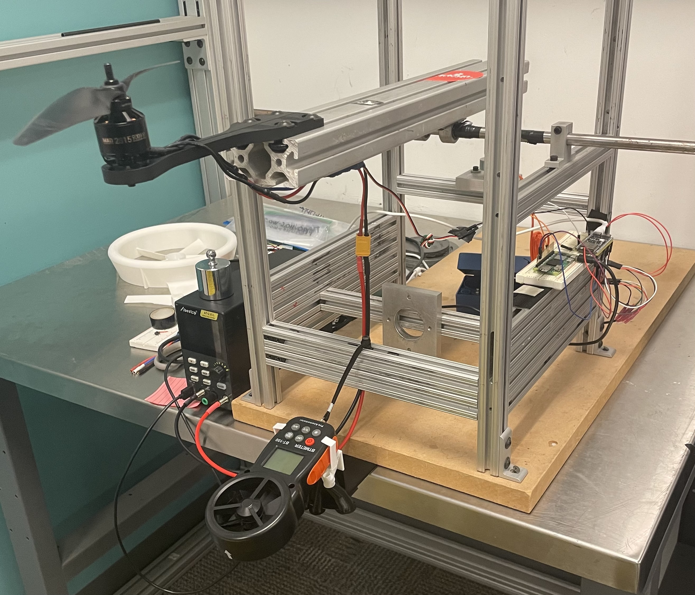

# Load Cell Thrust Measurement Thrust Stand
Raspberry Pi–based load cell system for thrust measurement and/or load cell calibration.

## Project Overview
- Measures thrust using a load cell and **HX711 amplifier**.
- Runs data acquisition on a ESP32 and sends it via serial link to Raspberry Pi.
- Logs readings to CSV and provides Python tools for calibration and plotting.
- Designed for undergraduate research and lab use (e.g., EDF / propeller testing).
## You can use this repository to:
- Calibrate a new load cell.
- Run thrust tests at different PWM / throttle commands.
- Generate plots for reports and papers.
  
## Demo / Screenshots
Photo of the rig.

  
  Screenshot of terminal or plot of thrust vs time.

## Hardware
Load cell specs
- Sparkfun HX711 board
- ESP32-S3 Dev Board N16R8
- Raspberry Pi Zero 2
- Abestop PSU
- RC Electric Parts ESC
- MAD Motor 2815 900KV

## Software & Repo Structure
### Languages + main tools: Python and Arduino:
Arduino Libraries: 
- ESP-32-S3 Dev Board
- Hx711 Load Cell Amp
   
### Repo Structure
- Main/ – Thrust acquisition and plotting scripts + current work.
calibration/ – calibration scripts/notebooks
- CalibrationAndTests/ – diagrams, poster, etc.
    
## Getting Started
  Prerequisites (OS, Python version, Arduino core, etc.).
  Installation (clone repo, install requirements).
  Configuration (edit a config file, serial port, calibration constant).

## Usage
  How to:
    Run the main script.
      To Calibrate the load cell system
    Start a calibration run.
    Log data to CSV.
  Examples and expected outputs.
  
### Calibration
  Clear step-by-step procedure.
  Link to calibration script/notebook.
  Mention where the calibration factor is stored.

### Main
  Where CSVs get saved.
  Column meanings.
  Link to plotting/analysis scripts.

## Known Limitations / TODO / Roadmap
### Limitations:
Power supply limit: Limited Amperage Prevents Full Throttle Mapping
Data Noise: Raspberry Pi and ESP32 are connected via dupont pins and breadboard, transfering the setup to a PCB could limit noise in the data.
### TODO: -
### RoadMap:
Convert system to battery power with power distribution board for accurate inflight power motor draw. Ideally implemented with a current transducer.

## Future work/Ideas: 
For automated efficiency two additional sensor can be implemented with the data collection script.
- Current Draw Sensor (Current Transducer) can be implemented into the loadcell system. Note - The Abestop Power Supply Unit comes with a Transducer, therefore power measurements can be done through that. If the system is to be automated or changed to battery power, having a transducer can allow for automated current data collection.
- Anemometer Board: An air speed measurement PCB board that can relay airspeed data to the microcontroller would enhance data comprenhesion, as a map of throttle vs efficiency can be generated without needing to do multiple trials. 

## How to Give Feedback / Contribute
  Feedback form: Check Creator's Page
